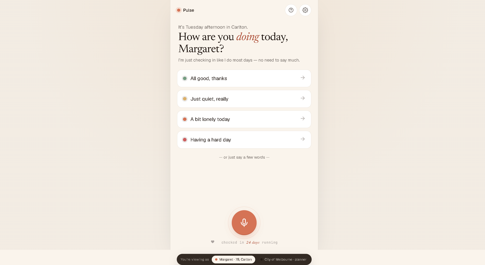
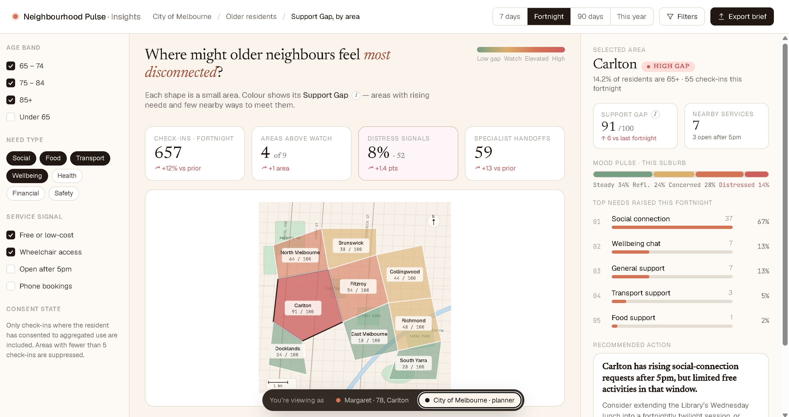
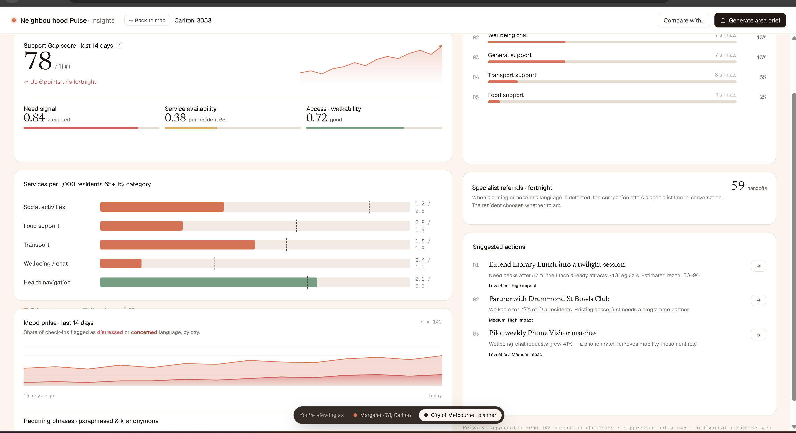

# Neighbourhood Pulse

A community wellbeing companion for the Anthropic Impact Lab. Built for older residents (65+) discovering nearby support, and for councils wanting privacy-safe visibility into connection gaps.

Build plan: [`docs/exec-plans/active/2026-05-23-neighbourhood-pulse-e2e-build.md`](./docs/exec-plans/active/2026-05-23-neighbourhood-pulse-e2e-build.md). Product context: [`docs/`](./docs/).

## Customer journey — older resident



## Dashboard — council view

Council planner overview, then the Carlton drill-in:





## Stack

One Express process at `:3000` serves the frontend at `/` and the API at `/api/*`.

- `frontend/` React 18 via CDN + in-browser Babel (no build step)
- `backend/` Express + better-sqlite3, schema in `backend/schema.sql`
- `mcp-server/` Cloudflare Worker MCP server for the voice companion (scaffolded)

## Run

```bash
cd backend
npm install
node --env-file=.env server.js
```

Open <http://localhost:3000/>. First start auto-creates `backend/data.sqlite` and seeds 10 Melbourne suburbs, 8 categories, ~17 services, and ~23 mock check-ins.

## End-to-end flow

```
                          ┌────────────────────────────────────────────────────┐
                          │   Margaret — 78, Carlton, opens localhost:3000     │
                          └─────────────┬──────────────────────────┬───────────┘
                                        │                          │
                       ┌────────────────┴────────┐    ┌────────────┴────────┐
                       │  RESIDENT input         │    │  COUNCIL view       │
                       │ ┌─────────┐ ┌─────────┐ │    │  on mount:          │
                       │ │ 4 mood  │ │ 🎤 mic  │ │    │  fetch('/api/       │
                       │ │ buttons │ │ button  │ │    │   dashboard/areas') │
                       │ └────┬────┘ └────┬────┘ │    └──────────┬──────────┘
                       └──────┼───────────┼──────┘               │
                              │           │                      │
                              │   POST /api/transcribe           │
                              │   (multipart audio)              │
                              │   ┌───────▼────────┐             │
                              │   │ ElevenLabs STT │ ← needs key │
                              │   └───────┬────────┘             │
                              │           │                      │
                              │      transcript                  │
                              └───────────┼──────────────────────┘
                                          │                      │
                              POST /api/checkins         GET /api/dashboard/areas
                                          │                      │
                                          ▼                      ▼
              ┌───────────────────────────────────────────────────────────────────┐
              │                  Express server (backend/server.js)               │
              └────────────┬─────────────────────────────────┬────────────────────┘
                           │                                 │
                           ▼                                 ▼
   ┌───────────────────────────────────────┐     ┌────────────────────────────────┐
   │   routes/checkins.js                  │     │   routes/dashboard.js          │
   │                                       │     │                                │
   │   if (agent.isEnabled()):             │     │  • SELECT COUNT(*) per area    │
   │     ┌──────────────────────────────┐  │     │  • GROUP BY need_type_id       │
   │     │ AGENTIC LAYER — agent.js     │  │     │  • compute gap_score live      │
   │     │  Anthropic SDK ─► Claude     │  │     │  • specialists + phrases tbls  │
   │     │  claude-opus-4-7, adaptive   │  │     │  • mood_pulse aggregate        │
   │     │  thinking, effort=low (≈4s)  │  │     │                                │
   │     │                              │  │     │  Returns: areas[], mood_pulse, │
   │     │  Returns JSON:               │  │     │           specialists, phrases │
   │     │   need_type                  │  │     └────────────────┬───────────────┘
   │     │   distress.urgency           │  │                      │
   │     │   key_phrases[1-3]           │  │                      │
   │     │   warm_reply                 │  │                      │
   │     └───────────┬──────────────────┘  │                      │
   │                 │                     │                      │
   │   catch (AgentUnavailable):           │                      │
   │     classifier.js regex + templated   │                      │
   │     warm_reply (system stays live)    │                      │
   │                 │                     │                      │
   │                 ▼                     │                      │
   │   DETERMINISTIC LAYER                 │                      │
   │   • INSERT INTO checkins (+ agent     │                      │
   │     columns)                          │                      │
   │   • recommender.js → top-3 (ERD §FR5  │                      │
   │     weights 40/25/20/15)              │                      │
   │   • INSERT INTO recommendations       │                      │
   └─────────────────┬─────────────────────┘                      │
                     │                                            │
                     ▼                                            ▼
   ┌────────────────────────────────────────────────────────────────────────────┐
   │           SQLite — backend/data.sqlite (WAL, FK on)                        │
   │  areas · checkins · need_types · support_services · service_categories     │
   │  recommendations · specialists · recurring_phrases · area_insights         │
   └────────────────────────────────────────────────────────────────────────────┘
                     │                                            │
                     ▼ response JSON                              ▼ response JSON
   ┌───────────────────────────────────────┐     ┌────────────────────────────────┐
   │  Resident frontend (resident-app.jsx) │     │  Council frontend              │
   │  • renders recs cards + scores        │     │  (council-dashboard.jsx)       │
   │  • "· live · social_connection" tag   │     │  • mutates window.SUBURBS      │
   │  • window.speechSynthesis.speak(      │     │    with live gap_score /       │
   │    warm_reply) ← VOICE LOOP CLOSED    │     │    checkins / service_count    │
   │  • if distress.is_distressed:         │     │  • re-renders heatmap polygons │
   │      setScreen('support')             │     │  • side panel shows live top   │
   │      → Lifeline 13 11 14              │     │    needs + recommended action  │
   └───────────────────────────────────────┘     └────────────────────────────────┘
```

## API

| Method | Path | Purpose |
|--------|------|---------|
| GET    | `/api/health` | Health check |
| POST   | `/api/checkins` | Classify need, return scored recs + `warm_reply` + `distress` + `key_phrases` |
| GET    | `/api/services` | List services. `?suburb=&need_type=` |
| GET    | `/api/dashboard/areas` | Suburb-level live aggregates |
| POST   | `/api/transcribe` | Multipart audio → transcript (ElevenLabs `scribe_v1`) |
| POST   | `/api/voice-agent/token` | Short-lived WebRTC token for the convai bubble |

## Configuration

```bash
cp backend/.env.example backend/.env
# ANTHROPIC_API_KEY=sk-ant-...     for Claude classification + warm replies
# ELEVENLABS_API_KEY=...            for /api/transcribe and the convai bubble
node --env-file=.env server.js
```

Either key can be omitted; the app degrades gracefully. The boot banner prints which voice paths are enabled.

## Smoke test

```bash
cd backend && npm start            # terminal 1
cd backend && npm run smoke        # terminal 2
```

## Known limitations

- In-browser Babel transpile (slow first load, fine for demo).
- Voice paths require ElevenLabs key.
- KPI cards on the dashboard are still hardcoded placeholder values; live-wiring on `feature/claude-agent-layer`.
- MCP server scaffold not deployed.
- No auth (deferred per ERD §3); no real map (suburb-string lookups only).
