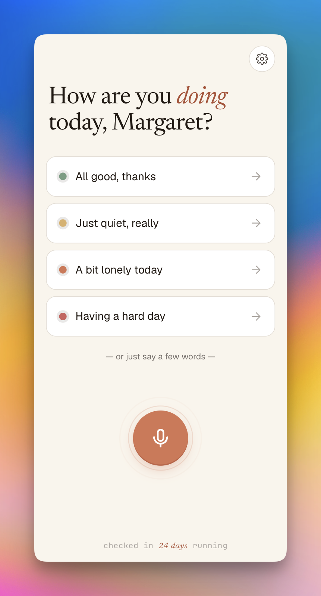
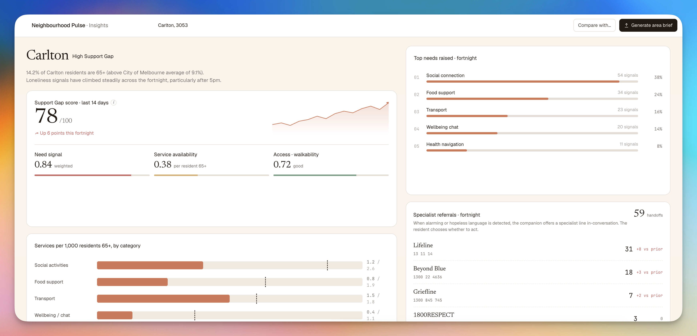
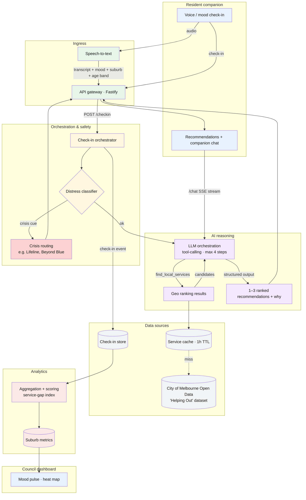
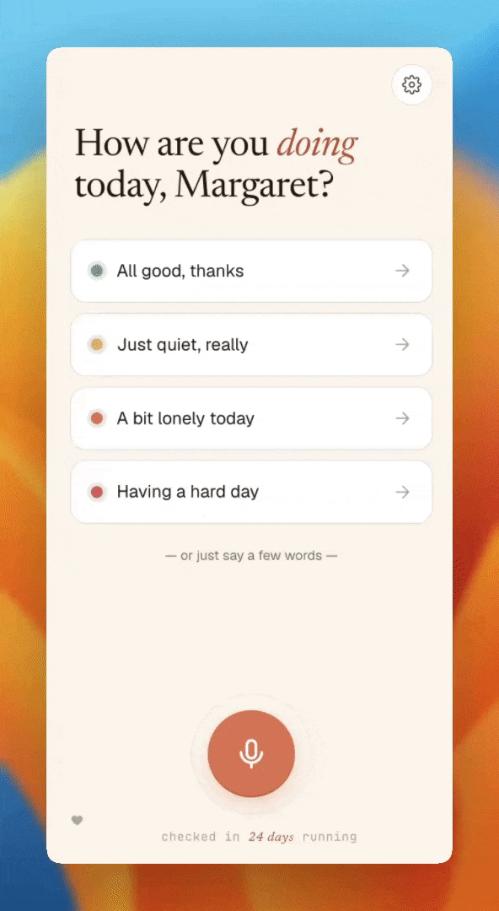

# Neighbourhood Pulse

A community wellbeing companion for the Anthropic Impact Lab 2026. Built for older residents (65+) discovering nearby support, and for councils wanting privacy-safe visibility into connection gaps.

Our entry consists of 2 apps: a hyper-localised resident companion and an council insights dashboard.

**Resident Companion app**: Users are served prompts with accessible one-tap check-ins. Voice mode and a small set of tools let the companion go deeper when someone wants to talk and discover nearby support.

<p align="center">
  
</p>

**Council Insights app**: An aggregate view - 'mood pulse', heat map, and suburb panels - showing where residents are doing it tough. Tap into any suburb for a closer read of what's driving the signal.

<p align="center">
  
</p>

<p align="center">
  
</p>

## System Architecture



## Setup & Run

```sh
pnpm install
cp .env.example .env   # set ANTHROPIC_API_KEY
pnpm dev
```

Open browser at <http://localhost:5173/>

## Structure

- `src/components/resident/` — companion app
- `src/components/dashboard/` — council dashboard
- `server/` — Fastify API

## Build plan

[`docs/exec-plans/active/2026-05-23-neighbourhood-pulse-e2e-build.md`](./docs/exec-plans/active/2026-05-23-neighbourhood-pulse-e2e-build.md). Product context: [`docs/`](./docs/).

## Demo

<p align="center">
  
</p>

---
